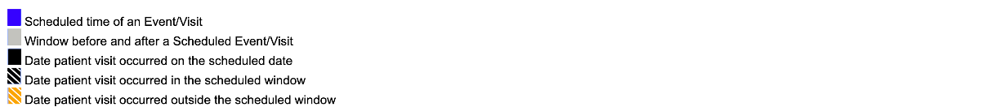
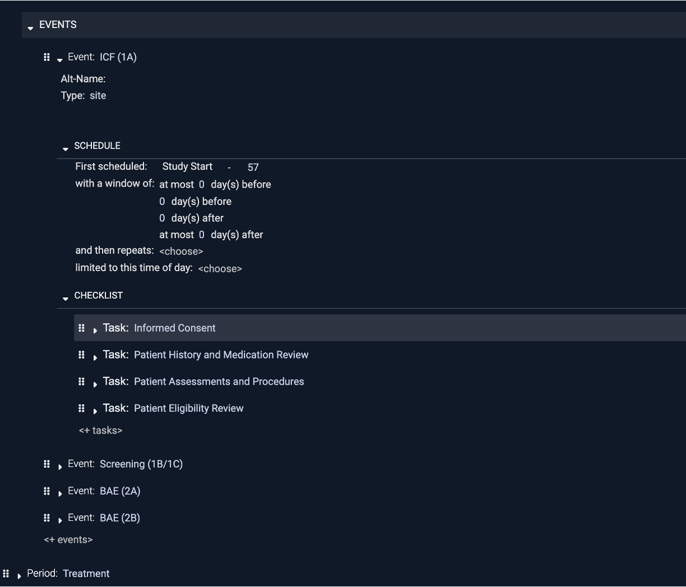

[TOC]

# Introduction

The *CRC-Hub Study Designer* is an alternative to creating spreadsheets that show the study schedule and to writing checklists on paper or in a document. The CRC Study Designer is part of the CRC-Hub product. Throughout this document 'Designer' is short for ' CRC-Hub Study Designer'. To replace spreadsheets and other manually written documents the Designer supports:
- Defining the events in a study and the details of their schedule. An event is typically a patient visit but it can be anything that needs to be done by site personnel
- Defining the checklist of things to do for each event
- Generating a document(s) containing the schedule and checklists that can be printed or viewed online

 Sites that work with paper so that they do not have a computer between them and the patient use just the Designer. This document describes that way of using the Designer. The CRC-Hub is for sites that want to be guided through the schedule of work done for a study. When used with the full CRC-Hub, the Designer generates the study specific web site and checklists. The full CRC-Hub features are not the focus here. 

# Define Events and Their Schedule

While each Event must be defined in order for it to have a checklist, it is optional to add details of the schedule. 

## Create or Select the Study

## Define the Events

The Designer makes it easy to create events [see video for details]()

- Click the plus next to 'Study Periods' and enter the name
- Click the plus next to 'Events' and enter the name
- Click the ︾ to make a smart copy of an event. The name is automatically incremented, e.g., 'V1' becomes 'V2' and, as will be discussed when scheduling details are covered, things like scheduling dependencies are automatically updated.
- Copy-and-Paste, Cut-and-Paste, or Drag-and-Drop one or more Events as needed
- Undo (ctrl-Z) and Redo (ctrl-Y) here or anywhere else in the Designer

The goal is, if you know the schedule of events from the protocol, it should take less time than you can type the names of the events to setup the study structure. 

## Define the Schedule

The Designer makes is easy to create complex schedules. In this example the 'V1 run in' visit is scheduled when 3 days after 'V1 rando' completes with a window of 2 days before or after. You are guided through schedule creation, e.g., when you get to the place showing 'when' you are given all the choices for when an event can be first scheduled and based on what you select other options are shown. It is like typing in Word or Excel if those tools *understood* clinical trials.

## View Schedule Charts

The following are shown on the chart:

Accurately creating anything but a simple study schedule is hard because of things like dependencies between visits, repeating visits, overlapping windows. The Designer allows you to immediately view a chart of the schedule you can zoom and scroll through. You can seamlessly move back and forth between trying different ways to express the schedule and seeing if it's correct. The above shows a chart with repeating visits that have complex dependencies.

## View Schedule Tables

The timeline of study events can also be viewed as a table with the same seamless moving back and forth between the the table and the schedule. A variety of table formats can be supported, e.g., visits of different types shown in side-by-side instead of one longer table. Events can be given alternative names that automatically reflect counts of repeating visits, e.g., 'V14-V18 run in (2)' for the second occurrence of a visit in the 'V14-V18 run in'  repetitions.

# Define Checklists

A checklist is a list of tasks to be done during a visit.

The Designer makes it easy to create checklists of things to do at any event. Checklists are shared and standardized rather than custom created in something like a spreadsheet, document, or notebook. To start, only a minimum can be captured, e.g., just a list of tasks to be done in a visit as shown above for the Informed Consent visit.

## Steps

The steps that describe the details of how to do a task can be added.

## Step Details

Details about each step can be added.

Details about each step, e.g., referenced documents or people to contact, can be added. This is particularly useful when the checklist is viewed online because you can click on the links to references or contacts.

# Save or Print Study Design

By the press of a button, some or all of the Schedule chart and table and the checklist are saved as a document. The document can be printed and used with printed data collection forms. 

The design as a document contains the following sections.

## Table of Contents Section

Not all the sections are populated in the above example, e.g., there are no checklists for the Treatment period.

## Timeline Section

## Checklists Section

## Benefits
While conducting a patient visit:
- The checklist can serve as guidance for details of things to be done in or after the visit as well as how to fill the paper or electronic data collection forms.
- The schedule chart can be used to review the patients timeline and schedule future visits

Paper or electronic versions of checklists are particularly helpful when:
- Working on a new study
- Covering for someone or someone is covering for you
- As living SOPs that can be reviewed with monitors, sponsors, or IRBs

# View Patient Charts

The Designer also allows entry of the date each patients visit and dates when the patient isn't available. A patient chart can be generated showing this information.

# View Staff Availability Charts
