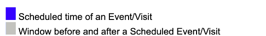

[TOC]

# Introduction

The *CRC-Hub Study Designer* is an alternative to creating spreadsheets that show the study schedule and to writing checklists on paper or in a document. It is for staff at clinical trial sites that work with paper to avoid having a computer between them and the patient. The CRC-Hub Study Designer is part of the CRC-Hub product.[^1] Throughout this document, 'Designer' is short for 'CRC-Hub Study Designer'. 

To replace spreadsheets and other manually written documents the Designer supports:
- Defining the events in a study and optionally the details of their schedule. An event is typically a patient visit but it can be anything that needs to be done by site personnel
- Defining the checklist of things to do for each event. 
- Generating a document(s) containing the schedule and checklists that can be printed or viewed online

[^1]: This document describes using the Designer. The full CRC-Hub product is for sites that want to be guided on a computer, rather than paper, through the tasks done for a study. When used with the full CRC-Hub, the Designer generates the study specific web site and checklists of tasks. The full CRC-Hub features are not the focus here. 

# Define Events and Their Schedule

## Create or Select the Study

To get started you create a study and optionally enter a few bits of information about it like the phase or theraputic area. Once created clicking on the study name takes you to the pages where you can see the Study Design.

## Define the Events

The study events/visits within the periods defines the overall structure and at least one period and visit need to be defined.

The Designer makes it easy to create periods and their events [see video for details]()

- Simply clicking the plus next to 'Study Periods' and entering the name creates a period. Clicking the plus next to 'Events' and entering the name creates an event.
- The ︾ make a smart copy of an event. Smart copying automatically increments the name, e.g., 'V1' becomes 'V2' and any scheduling dependencies are automatically duplicated and updated. The Designer has many such 'smart' actions. 
- Copy-and-Paste, Cut-and-Paste, or Drag-and-Drop of periods, events, or any of their parts works here or anywhere else in the Designer as does Undo (ctrl-Z) and Redo (ctrl-Y) 

The goal is, if you know the schedule of events from the protocol, the Designer's understanding of clinical trial study structure allows you to set it up faster than you could type the names into a document. 

## Define the Schedule

The Designer makes is easy to create complex schedules. In this example the 'V1 run in' visit is scheduled when 3 days after 'V1 rando' completes with a window of 2 days before or after. You are guided through schedule creation, e.g., when you get to the place showing 'when' you are given all the choices for when an event can be first scheduled and based on what you select other options are shown. It is like typing in Word or Excel if those tools *understood* clinical trials.

## View Schedule Charts

Accurately creating anything but a simple study schedule is hard because of things like dependencies between visits, repeating visits, and overlapping windows. The Designer allows you to immediately view a chart of the schedule that you can zoom and scroll through. You can seamlessly move back and forth between trying different ways to express the schedule and seeing if it's correct. The following shows a chart with repeating visits that have complex dependencies.

The chart shows:

This initial view of the schedule chart shows the entire study duration so only some of the study weeks are displayed on the axis. Zooming in on the Study Timeline allows you to see study days and study weeks.

## View Schedule Tables

The timeline of study events can also be viewed as a table similar to what might be created in Excel. The same seamless moving back and forth between the schedule and the table can be done. 

A variety of table formats can be supported, e.g., visits of different types shown side-by-side instead of one longer table. As shown in the table, events can be given alternative names that automatically reflect counts of repeating visits, e.g., 'V14-V18 run in (2)' for the second occurrence of a visit in the 'V14-V18 run in'  repetitions.

# Define Checklists

A *checklist* defines the tasks to be done during an event/visit. The Designer makes it easy to create checklists of things to do at any event.

 Checklists are shared and standardized rather than custom created in something like a spreadsheet, document, or notebook. To start, only a minimum can be defined, e.g., just a list of tasks to be done in a visit as shown above for the ICF event where there are four tasks in the checklist.

## Steps

A description of the task as well as the steps that explain the details of how to do a task can be added. The description and three steps for the Informed Consent task are shown below.

## Step Details

Each step can have additional details added as shown by the description and three bullets under the Obtain Informed Consent step.

Details about each step can include things like referenced documents or people to contact. This is particularly useful when the checklist is viewed online because you can click on the links to references or contacts.

## Summary

TODO: Summarize the ideas of the study structure and scheduling...

The Designer structure:
- Study Structure
  - Events (a.k.a Visits) each has:
    - Event Schedule
    - Checklist of Tasks and Steps for a Task

The schedule and checklists are optional. 

You can use just the scheduling features of the Designer to get charts and tables showing the schedule to help with:
- Confirming understanding of the protocol
- Showing site specific events that are not in the protocol 
- Seeing a patients progress thru the study and what their future schedule should be
- Superimposing staff availability onto a study schedule

You can use just the checklist features of the Designer to 

TODO: Add AI / heuristics to make quick setup of scheduling, e.g., multiselect event names and select make-repeating, make-dependent, etc. 

# Save or Print Study Design

By the press of a button, some or all of the chart and table views of the schedule and the checklist are saved as a document. The document can be printed to support using the studies printed data collection forms. 

The study design as a document contains the following sections.

## Table of Contents Section

The printable document starts with a table-of-contents. Not all the sections in the document are populated in this example, e.g., there are no checklists for the Treatment period. There is no requirement that you fill them all. You might start with just the first few and add details as you do real visits. 

## Timeline Section

## Checklists Section

## Benefits

While conducting a patient visit:
- The checklist can serve as guidance for details of things to be done in or after the visit as well as how to fill the paper or electronic data collection forms.
- The schedule chart can be used to review the patients timeline and schedule future visits

Paper or electronic versions of checklists are particularly helpful when:
- Working on a new study
- Covering for someone or someone is covering for you
- As living SOPs that can be reviewed with monitors, sponsors, or IRBs

# View Patient Charts

The Designer also allows entry of the dates of patients visit and dates when the patient isn't available. A patient chart can be generated showing this information.

# View Staff Availability Charts

The availability of staff or other resources can be entered and included on the charts. The following shows a study schedule with staff availability. 

