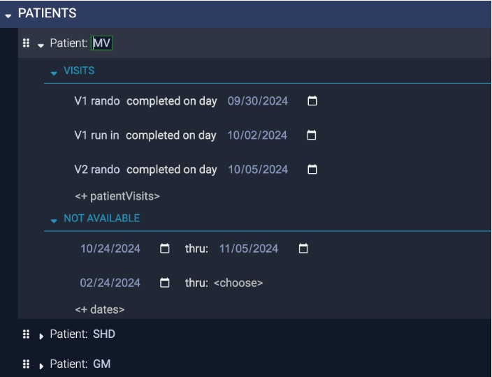

[TOC]

# Introduction

The *CRC-Hub Study Designer* is an alternative to creating spreadsheets for the study schedule and to writing checklists of things to do in a visit. It is for staff at clinical trial sites that work with paper to avoid having a computer between them and the patient. The CRC-Hub Study Designer is part of the CRC-Hub product.[^1] Throughout this document, 'Designer' is short for 'CRC-Hub Study Designer'. 

To replace spreadsheets and other manually written documents the Designer supports:
- Defining the events in a study and optionally the details of their schedule. An event is typically a patient visit but it can be anything that needs to be done by site personnel
- Defining the checklist of things to do for each event. 
- Generating a document(s) containing the schedule and checklists that can be printed or viewed online

The following walks through defining and generating these aids for doing the work of a study.

[^1]: This document describes using the Designer. The full CRC-Hub product is for sites that want to be guided on a computer, rather than paper, through the tasks done for a study. When used with the full CRC-Hub, the Designer generates the study specific web site and checklists of tasks. The full CRC-Hub features are not the focus here. 

# Define Events and Their Schedule

## Create or Select the Study

To get started you create a study and optionally enter a few bits of information about it like the phase or theraputic area. Once created clicking on the study name takes you to the pages where you can see the Study Design.

## Define the Events

The study events within the periods defines the overall structure and at least one period and event need to be defined. An *Event* is typically a visit but can be any point where work needs to be done by site staff. The picture below show four events in the Screening period.

> #TODO: Investigate why the empty description is shown as blank space rather than <description>. Consider an option to not show the description so there is not the blank space between the period and the Events. 

The Designer makes it easy to create periods and their events, [see this video for a live example]()

- Simply clicking the plus next to STUDY PERIODS or EVENTS and entering the name creates an event.
- The ︾ make a smart copy of the event. Smart copying automatically increments the name, e.g., 'V1' becomes 'V2' and any scheduling dependencies are automatically duplicated and updated. The Designer has many such *smart actions*. 
- Copy-and-Paste, Cut-and-Paste, and Drag-and-Drop of periods, events, or any of their parts works here or anywhere else in the Designer as does Undo (ctrl-Z) and Redo (ctrl-Y) 

The goal is, if you know the schedule of events from the protocol, the Designer's understanding of clinical trial study structure allows you to set it up faster than you could type the names into a document. 

## Define the Schedule

The Designer makes is easy to create even complex schedules. In this example the `V1 run in` visit is scheduled when 3 days after `V1 rando` completes with a window of 2 days before or after. You are guided through schedule creation, e.g., when you get to the place showing 'when' you are given all the choices for when an event can be first scheduled and based on what you select other options are shown. It is like typing in Word or Excel if those tools *understood* clinical trials.

If you look closely you'll see that in the `First scheduled: when` there is a small arrow `→` next to the `V1 rando` event that `V1 run in` is dependent on. Clicking on that arrow jumps you to that Event. This is an example of the way everything in the Designer is interconnected and how it makes it simple to move within even a complex schedule.

## View Schedule Charts

Accurately creating anything but a simple study schedule is hard because of things like dependencies between visits, repeating visits, overlapping windows, etc. The Designer allows you to write the scheduling in the words of a clinical trial. At any point you can view a timeline chart of the schedule that you can zoom and scroll through. You can seamlessly move back and forth between trying different ways to express the schedule and seeing if it's correct. The following shows a chart with repeating visits that have complex dependencies. You can view the chart as soon as define any scheduling and use it to help you incrementally define an accurate view of the study schedule.

The chart shows

This initial view of the schedule chart shows the entire study duration so only some of the study weeks are displayed on the axis. Zooming in on the allows you to see study days and study weeks.

## View Schedule Tables

The timeline of study events can also be viewed as a table similar to what might be created in Excel. The same seamless moving back and forth between the schedule and the table can be done. 

Zooming in on the table...

A variety of table formats can be supported, e.g., visits of different types shown side-by-side instead of one longer table. As shown in the table, events can be given alternative names that automatically reflect counts of repeating visits, e.g., 'V14-V18 run in (2)' for the second occurrence of a visit in the 'V14-V18 run in'  repetitions.

# Define Checklists

A *checklist* defines the tasks to be done during an event. The Designer makes it easy to create checklists of things to do at any event. The picture below shows the checklist of four tasks of the `ICF (1A)` event. The reason to create a checklist in the Designer is so you can print it out and use it while with a patient conducting a visit. 

 Checklists are shared and standardized rather than custom created in something like a spreadsheet, document, or notebook. To start, only a minimum can be defined, e.g., just a list of tasks to be done in a visit as shown above for the ICF event where there are four tasks in the checklist. Additional details can be added at any time.

## Steps of a Task

A description of the task as well as the steps that explain the details of how to do a task can be added. The description and three steps for the Informed Consent task are shown below.

## Details of a Step

Each step can have additional details added as shown by the description and three bullets under the Obtain Informed Consent step.

Details about each step can include things like referenced documents or people to contact. This is particularly useful when the checklist is viewed online because you can click on the links to references or contacts.

# Save or Print Study Design

By the press of a button, some or all of the chart and table views of the schedule and the checklist are saved as a document. The document can be printed to support doing the work of a visit and combined with using the studies printed data collection forms. 

The study design as a document contains the following sections.

## Table of Contents Section

The printable document starts with a table-of-contents. Not all the sections in the document are populated in this example, e.g., there are no checklists for the Treatment period. There is no requirement that you fill them all. You might start with just the first few and add details as you do real visits. 

## Timeline Section

The table view and the timeline chart are the first things in the document. A separate file containing the timeline chart is also generated. It can be opened separately and all the zooming and scrolling features are supported without opening the Designer. 

## Checklists Section

All the checklists at whatever level of detail that was defined are printed. If scheduling was defined, a text description of the schedule of each is included. 

# View Patient Charts

The Designer also allows entry of the dates of patients visit and dates when the patient isn't available. A patient chart can be generated showing this information. The following shows a few visits recorded for the `MV' patient.

The timeline of the patient includes 

# View Staff Availability Charts

The availability of staff or other resources can be entered and included on the charts. The following shows a study schedule with staff availability. 

The staff availabilit is presented as: 

# Summary and Benefits

The Designer allows you to define the study periods and events (a.k.a visits) and for each event:
    - The schedule
    - A checklist of tasks and their steps

You can define scheduling or checklists or both. You can start with one and add the other later. You can start with just parts of them and expand them as you learn about the study.

You can use just the scheduling features of the Designer to get charts and tables showing the schedule to help with:
- Confirming understanding of the protocol
- Showing site specific events that are not in the protocol 
- Seeing a patients progress thru the study and what their future schedule should be
- Superimposing staff availability onto a study schedule

You can use just use paper or electronic versions of the checklist to help with:
- Guidance for details of things to be done in or after the visit as well as how to fill the paper or electronic data collection forms.
- Working on a new study
- Covering for someone or someone is covering for you
- As living SOPs that can be reviewed with monitors, sponsors, or IRBs

You are never locked into using the Designer. We don't save any data that you can't simply copy to your own documents. You can use it to get started and switch to your old way of working easily. Simply copy and paste from the saved document into Word or Excel any of:
- The description and table view of the schedule  
- The checklist and all it's details
- The patient visit history
- The staff availability

We're working on generating excel versions of the schedule and it's charts which you can then manually change. 

Our mission is for you to never want to stop using the Designer. We believe the Designers built-in understanding of clinical trials makes our guided editing faster than any other way to setup things needed for your site. It's just the beginning and we're constantly adding as we learn other ways to make doing the work of the study easier.

## Better than Excel

The premise for the benefits of the Designer is that using it is better than using Excel. Excel is essentially free and understood at some level by all site staff. However using it requires creating potentially complex and fragile formulas specific to the study vs. all scheduling is written is the language of clinical trials, e.g., you basically write: visit X is first scheduled 10 days after visit Y completing with a 2 day window and then repeats 4 times. The value of everyone being able to simply read these words can't be understated. Beyond this clear textual description of the schedule the presentation as an interactive timeline chart takes schedule understandability to another level. 

Combining the timeline charts with the ability to add the actual patient visits and other patient events to the timeline and have the timeline shift to reflect it goes beyond just understanding the schedule to providing the tool for patient specific scheduling of next appointments and compliance.    

It isn't reasonably possible to model the details of the following kinds of schedules in Excel but it's easy in the Designer:
- Repeating visits, especially if they have interesting dependencies, e.g., two repeating kinds of visits that depend on each other such as a run-in visit that depends on a corresponding randomization visit.
- Unscheduled visits that shift or trigger other visits, e.g., when the patient experiences some symptom an unscheduled visit must happen and subsequent visits are shifted.
- Phase transitions based on patient events
- Calculated visit windows
- TODO: what other things are difficult to model in excel