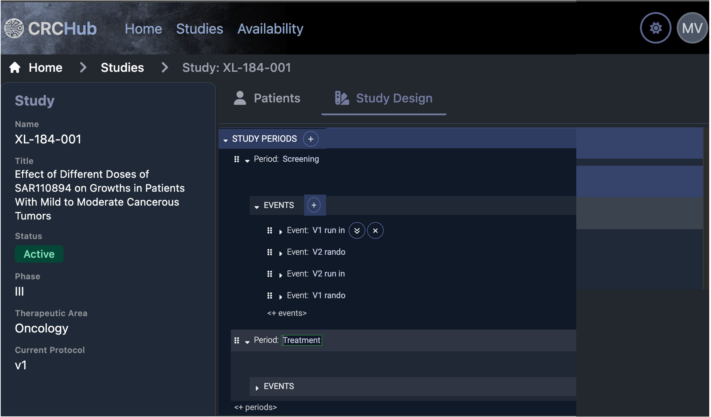

[TOC]

# Introduction

The *CRC-Hub Study Designer* is an alternative to creating spreadsheets that show the study schedule and to writing checklists on paper or in a document. The CRC Study Designer is part of the CRC-Hub product. Throughout this document 'Designer' is short for ' CRC-Hub Study Designer'. To replace spreadsheets and other manually written documents the Designer supports:
- Defining the events in a study and the details of their schedule. An event is typically a patient visit but it can be anything that needs to be done by site personnel
- Defining the checklist of things to do for each event
- Generating a document(s) containing the schedule and checklists that can be printed or viewed online

 Sites that work with paper so that they do not have a computer between them and the patient use just the Designer. This document describes that way of using the Designer. The CRC-Hub is for sites that want to be guided through the schedule of work done for a study. When used with the full CRC-Hub, the Designer generates the study specific web site and checklists. The full CRC-Hub features are not the focus here. 

# Define Events and Their Schedule

While each Event must be defined in order for it to have a checklist, it is optional to add details of the schedule. 

## Create or Select the Study

## Define the Events

The Designer makes it easy to create events [see video for details]()

- Click the plus next to 'Study Periods' and enter the name
- Click the plus next to 'Events' and enter the name
- Click the ︾ to make a smart copy of an event. The name is automatically incremented, e.g., 'V1' becomes 'V2' and, as will be discussed when scheduling details are covered, things like scheduling dependencies are automatically updated.
- Copy-and-Paste, Cut-and-Paste, or Drag-and-Drop one or more Events as needed
- Undo (ctrl-Z) and Redo (ctrl-Y) here or anywhere else in the Designer

The goal is, if you know the schedule of events from the protocol, it should take less time than you can type the names of the events to setup the study structure. 

## Define the Schedule

The Designer makes is easy to create complex schedules. In this example the 'V1 run in' visit is scheduled when 3 days after 'V1 rando' completes with a window of 2 days before or after. You are guided through schedule creation, e.g., when you get to the place showing 'when' you are given all the choices for when an event can be first scheduled and based on what you select other options are shown. It is like typing in Word or Excel if those tools *understood* clinical trials.

## View Schedule Charts

Accurately creating anything but a simple study schedule is hard because of things like dependencies between visits, repeating visits, overlapping windows. The Designer allows you to immediately view a chart of the schedule you can zoom and scroll through. You can seamlessly move back and forth between trying different ways to express the schedule and seeing if it's correct. The above shows a chart with repeating visits that have complex dependencies.

## View Schedule Tables

# Define Checklists

# Save or Print Study Design

# View Patient Charts

# View Staff Availability Charts
