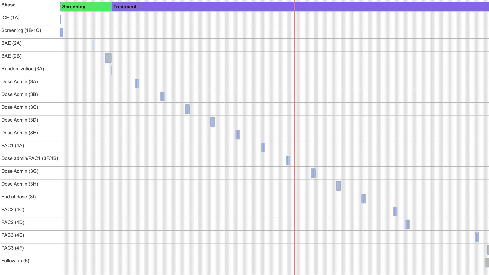

Study 123ABC 
==============

The timeline and visit checklists for the study.

**Author:** *Mike Vogel CRC Manager*

[toc]

# Study Timeline 

## Table
| Visit Name              | Alternative Name | Phase     | Window (-) | Day/Date | Window (+) |
| :---------------------- | :--------------- | :-------- | :--------- | :------- | :--------- |
| [ICF (1A)](#icf-1a)                |                  | Screening | 0          | -56      | 0          |
| [Screening 1B/1C](#screening-1b1c)   |                  | Screening | 1          | -55      | 1          |
| BAE (2A)                |                  | Screening | 0          | -20      | 0          |
| BAE (2B)                |                  | Screening | 0          | -6       | 6          |
| Randomization (3A)      |                  | Treatment | 0          | 1        | 0          |
| Dose Admin (3A)         |                  | Treatment | 2          | 29       | 2          |
| Dose Admin (3B)         |                  | Treatment | 2          | 57       | 2          |
| Dose Admin (3C)         |                  | Treatment | 2          | 85       | 2          |
| Dose Admin (3D)         |                  | Treatment | 2          | 113      | 2          |
| Dose Admin (3E)         |                  | Treatment | 2          | 141      | 2          |
| PAC1 (4A)               |                  | Treatment | 2          | 169      | 2          |
| Dose admin/PAC1 (3F/4B) |                  | Treatment | 2          | 197      | 2          |
| Dose admin/PAC1 (3G/4C) |                  | Treatment | 2          | 197      | 2          |
| Dose admin/PAC1 (3G/4C) |                  | Treatment | 2          | 197      | 2          |
| Dose admin/PAC1 (3H/4D) |                  | Treatment | 2          | 197      | 2          |
| Dose Admin (3G)         |                  | Treatment | 2          | 225      | 2          |
| Dose Admin (3H)         |                  | Treatment | 2          | 253      | 2          |
| End of dose (3I)        |                  | Treatment | 2          | 281      | 2          |
| PAC2 (4C)               |                  | Treatment | 2          | 316      | 2          |
| PAC2 (4D)               |                  | Treatment | 2          | 330      | 2          |
| PAC3 (4E)               |                  | Treatment | 2          | 407      | 2          |
| PAC3 (4F)               |                  | Treatment | 2          | 421      | 2          |
| Follow up (5)           |                  | Treatment | 5          | 421      | 5          |

## Chart

[View the interactive chart of the schedule](../timeline.html)

---

# ICF (1A)

The purpose of this task is to obtain informed consent from the patient. This will involve discussing the study with them, then an internal medical discussion to determine their eligibility to move forward.

First scheduled: when Last completed + 4 days
with a window of: at most  0 day(s) before
                    0 day(s) before
                    0 day(s) after
               at most  0 day(s) after

and then repeats: <choose>
limited to this time of day: <choose>

## Task: Informed Consent
- [ ] Informed Consent Completed 

### Step 1 - Obtain Informed Consent
- [ ] Explain the study details, including purpose, procedures, risks, and benefits to the patient
- [ ] Obtain informed consent from the patient, ensuring they understand and agree to the study terms
- [ ] [Optional] Discuss with the patient about the possibility of using their data for future research

#### REFERENCES
- Protocol - Consent Definition
- Protocol - Inclusion/Exclusion Criteria
- Consent Form
- Guidance on Research Use of Data

#### PEOPLE
- Patricia Bellweather (Patient Recruiter) pbellweather@mail.com 509.555.3419

### Step 2 - Record Consent Decision
- [x] File the signed consent form in the patients clinical study folder
- [ ] Scan the signed consent form into the EHR system
- [ ] Record the signed consent into the EDC system

#### REFERENCES

- Record Keeping Guidelines
- Epic EHR (Robot Script Available)
- Medidata EDC (Robot Script Available)

### Step 3 - Inform Internal Medical Personnel

- [ ] Email Patricia with the result of the consent
- [ ] Inform Rachel and Mark about the patient consent

#### PEOPLE
- Patricia Bellweather (Patient Recruiter) pbellweather@mail.com 509.555.3419
- Rachel Auchliff (Site Rater) rauchliffe@mail.com 957.555.2323
- Mark Davis (Clinical Trial Administrator) mdavis@mail.com
---

# Screening (1B/1C)

- [ ] Screening (1B/1C) Completed 

## Task: Patient History and Medication Review

The purpose of this task is review the complete medical history for the patient, especially as it specifically relates to the patients participation in the study. It will be part of the final determination of their eligibility for the study.

### Step 1 - Review with Patient
Talk about the patients medical history and demographics
Conduct a review of prior and concomitant medications
Document and update patient information in the EHR system

- [ ] Review with Patient Completed 

#### REFERENCES
- Epic EHR
- Medicare Part D Coverage Database
- CDC Guidelines for Prescribing Opioids
- WHO Guide on Medication Review
- Protocol - Medication Review Process

#### PEOPLE
Rachel Auchliffe (Site Rater) rauchliffe@mail.com 957.555.2323

### Step 2 - Internal Medical Review

- [ ] Review with Patient Completed 

- Review summary with Rachel
- Email Dr. Emily Stanton with the review summary

#### PEOPLE
Dr. Emily Stanton (Chief Medical Officer) estanton@healthcare.org 908.555.4141
Rachel Auchliffe (Site Rater) rauchliffe@mail.com 957.555.2323

## Task: Patient Assessments and Procedures

## Task: Patient Eligibility Review

# BAE (2A)               
# BAE (2B)               
# Randomization (3A)     
# Dose Admin (3A)        
# Dose Admin (3B)        
# Dose Admin (3C)        
# Dose Admin (3D)        
# Dose Admin (3E)        
# PAC1 (4A)              
# Dose admin/PAC1 (3F/4B)
# Dose admin/PAC1 (3G/4C)
# Dose admin/PAC1 (3G/4C)
# Dose admin/PAC1 (3H/4D)
# Dose Admin (3G)        
# Dose Admin (3H)        
# End of dose (3I)       
# PAC2 (4C)              
# PAC2 (4D)              
# PAC3 (4E)              
# PAC3 (4F)              
# Follow up (5)           
