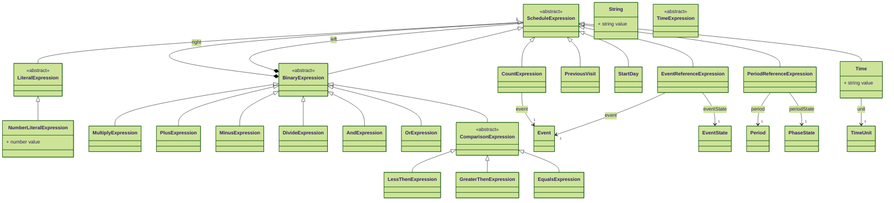

# Class diagram for file Expressions

```mermaid
    %%{init: {'theme': 'forest'} }%%
    classDiagram
    direction TD
    %% other possibilites: LR RL DT TB (same as TD)
    class ScheduleExpression {
        <<abstract>>
        
    }
    class EventReferenceExpression {
        
        
    }
    class PeriodReferenceExpression {
        
        
    }
    class Time {
        
        + string value
    }
    class PreviousVisit {
        
        
    }
    class StartDay {
        
        
    }
    class CountExpression {
        
        
    }
    class LiteralExpression {
        <<abstract>>
        
    }
    class String {
        
        + string value
    }
    class NumberLiteralExpression {
        
        + number value
    }
    class BinaryExpression {
        <<abstract>>
        
    }
    class MultiplyExpression {
        
        
    }
    class PlusExpression {
        
        
    }
    class MinusExpression {
        
        
    }
    class DivideExpression {
        
        
    }
    class AndExpression {
        
        
    }
    class OrExpression {
        
        
    }
    class ComparisonExpression {
        <<abstract>>
        
    }
    class LessThenExpression {
        
        
    }
    class GreaterThenExpression {
        
        
    }
    class EqualsExpression {
        
        
    }
    class TimeExpression {
        <<abstract>>
        
    }

    ScheduleExpression <|-- EventReferenceExpression
ScheduleExpression <|-- PeriodReferenceExpression
ScheduleExpression <|-- Time
ScheduleExpression <|-- PreviousVisit
ScheduleExpression <|-- StartDay
ScheduleExpression <|-- CountExpression
ScheduleExpression <|-- LiteralExpression
LiteralExpression <|-- NumberLiteralExpression
ScheduleExpression <|-- BinaryExpression
BinaryExpression <|-- MultiplyExpression
BinaryExpression <|-- PlusExpression
BinaryExpression <|-- MinusExpression
BinaryExpression <|-- DivideExpression
BinaryExpression <|-- AndExpression
BinaryExpression <|-- OrExpression
BinaryExpression <|-- ComparisonExpression
ComparisonExpression <|-- LessThenExpression
ComparisonExpression <|-- GreaterThenExpression
ComparisonExpression <|-- EqualsExpression

        BinaryExpression *-- "1" ScheduleExpression : left

		BinaryExpression *-- "1" ScheduleExpression : right

        EventReferenceExpression --> "1" Event : event

		EventReferenceExpression --> "1" EventState : eventState
PeriodReferenceExpression --> "1" Period : period

		PeriodReferenceExpression --> "1" PhaseState : periodState
Time --> "1" TimeUnit : unit
CountExpression --> "1" Event : event

        
```
