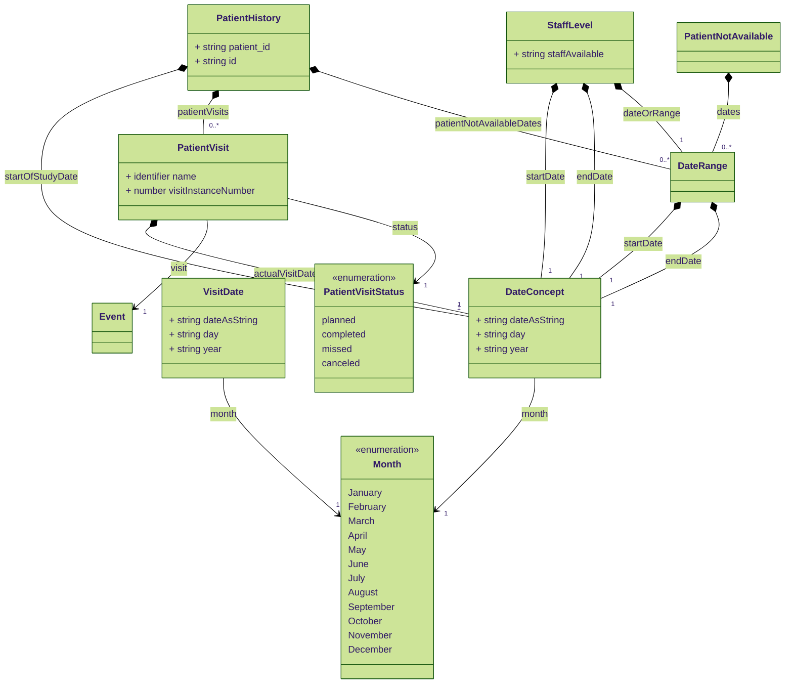

# Class diagram for file Patient

```mermaid
    %%{init: {'theme': 'forest'} }%%
    classDiagram
    direction TD
    %% other possibilites: LR RL DT TB (same as TD)
    class PatientHistory {
        
        + string patient_id
		+ string id
    }
    class PatientVisitStatus {
        <<enumeration>>
        planned
		completed
		missed
		canceled
    }
    class PatientVisit {
        
        + identifier name
		+ number visitInstanceNumber
    }
    class PatientNotAvailable {
        
        
    }
    class StaffLevel {
        
        + string staffAvailable
    }
    class Month {
        <<enumeration>>
        January
		February
		March
		April
		May
		June
		July
		August
		September
		October
		November
		December
    }
    class VisitDate {
        
        + string dateAsString
		+ string day
		+ string year
    }
    class DateRange {
        
        
    }
    class DateConcept {
        
        + string dateAsString
		+ string day
		+ string year
    }

    
        PatientHistory *-- "1" DateConcept : startOfStudyDate

		PatientHistory *-- "0..*" PatientVisit : patientVisits

		PatientHistory *-- "0..*" DateRange : patientNotAvailableDates
PatientVisit *-- "1" DateConcept : actualVisitDate
PatientNotAvailable *-- "0..*" DateRange : dates
StaffLevel *-- "1" DateConcept : startDate

		StaffLevel *-- "1" DateConcept : endDate

		StaffLevel *-- "1" DateRange : dateOrRange
DateRange *-- "1" DateConcept : startDate

		DateRange *-- "1" DateConcept : endDate

        PatientVisit --> "1" Event : visit

		PatientVisit --> "1" PatientVisitStatus : status
VisitDate --> "1" Month : month
DateConcept --> "1" Month : month

        
```
